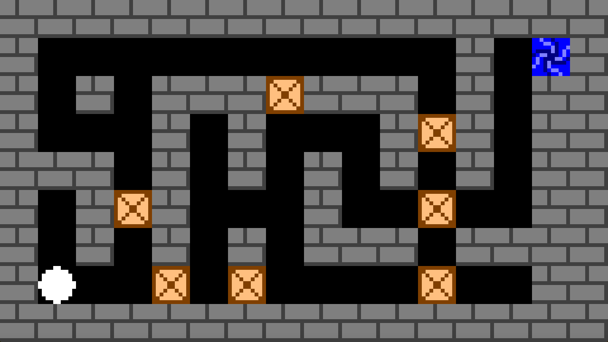
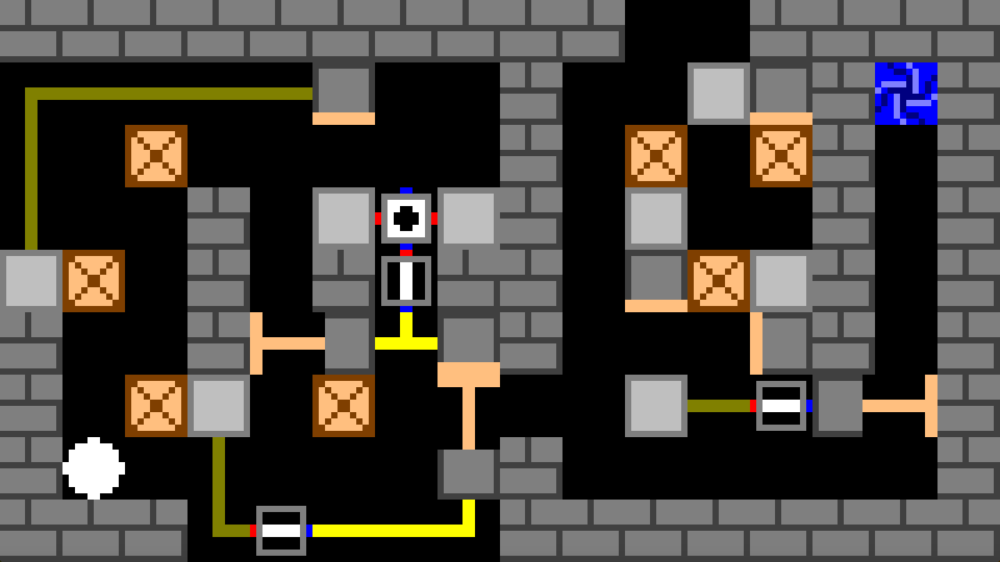
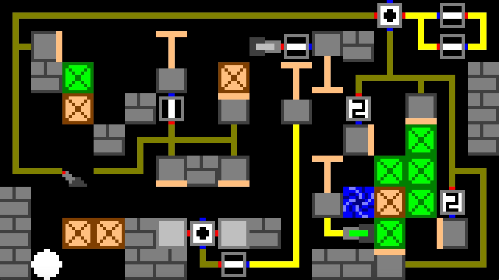

= The Machine
:toc:
:sectnums:
:experimental:

== The Machine

This is the web version of link:http://indi-kernick.itch.io/the-machine[The Machine] compiled using link:http://kripken.github.io/emscripten-site/docs/introducing_emscripten/about_emscripten.html[Emscripten]. This web version runs smoothly in Firefox and kind of slow and jittery in Chrome. You will need a recent version of either browser to run this game.

The Machine is my first published game so I hope you enjoy it.

The game features beautiful pixel art and animations with 376 hand drawn sprites. The sprites will scale well, (in other words, the graphics will look best) at the common 16:9 resolutions. If the resolution is a multiple of 320x180 then the art and animations will look best. This includes 1280x720, 1920x1080, 3840x2160, etc.

The Machine is about attention to detail. That lever looks like it opens the door to the exit but it really closes the door indefinitely (at least until you restart the level). You'll have to think carefully before taking action. The game is about understanding and reverse engineering The Machine to make your way to the exit. The levels escalate in difficulty fast so you'll feel like a genius when you finish the last one.

Progress can't be saved so if you want to save your progress, don't reload the page. The Mac version saves your progress automatically.

If you have a Mac, run the Mac version.

== Controls

=== Required

* kbd:[WASD] or arrows to move
* kbd:[Space] to activate things
* kbd:[R] to restart a level

=== Optional

* kbd:[B] to go back to the previous level
* kbd:[N] to go to the next level (if you've completed it)
* Start holding down kbd:[L], type a number, stop holding down kbd:[L] to navigate to a particular level.

More information

Status	Released
Platforms	HTML5
Rating	
Rated 5.0 out of 5 stars
(1total ratings)
Author	Indiana Kernick
Genre	Puzzle
Made with	SDL
Tags	2D, Pixel Art, Retro
Average session	A few minutes
Inputs	Keyboard
Leave a comment
Log in with itch.io to leave a comment.
